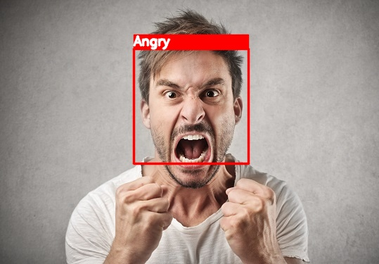
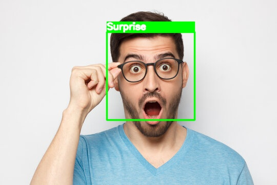
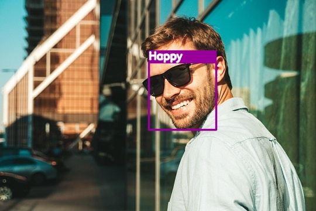

# Deep Facial Emotion Recognition

This is a PyTorch implementation of Deep Facial Emotion Recognition.

## Dataset
* [FER-2013](https://www.kaggle.com/c/challenges-in-representation-learning-facial-expression-recognition-challenge/data)

## Libraries
Libraries used in this project:
* pytorch >= 1.1.0
* torchvision == 0.5.0
* opencv
* tqdm
* PIL

## Content of files
This repository consists of such files:
* [data_loaders.py](/data_loaders.py) - This file contains the dataset class
* [generate_data.py](/generate_data.py) - This file contains the setup of the [FER-2013 dataset](https://www.kaggle.com/c/challenges-in-representation-learning-facial-expression-recognition-challenge/data)
* [deep_emotion.py](/deep_emotion.py) - This file contains the model class
* [main.py](/main.py) - This file contains training loop.
* [test.py](/test.py) - This file contains the code for evaluating the model on test data.
* [visualize.py](/visualize.py) - This file contains the code for evaluating the model on real images and webcam.

## Usage examples

  
  

  

